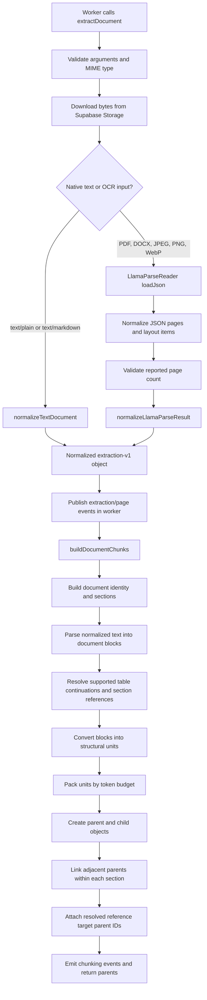

# Prompt: Explain the Document Extraction-to-Chunks Pipeline

Use this document as the complete technical context for analyzing, debugging, or changing the ingestion pipeline between the following two points in `src/workers/document.worker.js`.

The flow starts here:

```js
const extraction = await aiService.extractDocument({
  filepath,
  filename: document.filename,
  mimetype,
});
```

It stops immediately after this call returns:

```js
const parents = await buildDocumentChunks(
  extraction,
  documentId,
  document.filename,
  (event) => publishProgress(documentId, event),
);
```

Do not include embedding generation, database persistence, summary generation, retrieval, reranking, or chat in this scope. At the stopping point, parent and child objects exist in memory, but children do not yet have embeddings and nothing produced by this call has been saved to PostgreSQL.

## Required analysis rules

When using this prompt:

1. Treat the code described below as the source of truth.
2. Keep source text, structural interpretation, and generated search context separate.
3. Treat LlamaParse Markdown and layout items as parser output, not guaranteed structural truth.
4. Do not claim that every heading candidate becomes a confirmed heading.
5. Do not claim that every table continuation or section reference is resolved.
6. Do not describe parent and child limits as character limits. The current packer uses tokenizer measurements.
7. Remember that a parent cannot cross a normalized source/page boundary because `sourceId` is part of its grouping key.
8. Remember that `buildDocumentChunks()` returns parents with nested children before embeddings or persistence.

## Pipeline overview



## 1. Worker entry and inputs

File: `src/workers/document.worker.js`

The BullMQ worker receives these values from `job.data`:

```js
{
  documentId,
  filepath,
  mimetype,
}
```

It loads the stored filename from Prisma and passes the following object to the AI service:

```js
{
  filepath,                    // Supabase Storage object path
  filename: document.filename, // user-visible stored filename
  mimetype,                    // upload MIME type
}
```

The filename later contributes to document identity and to the contextual `searchText` prefix.

## 2. `extractDocument()`

File: `src/services/ai.service.js`

### 2.1 Input validation

`filepath`, `filename`, and `mimetype` must all be non-empty strings. The MIME type is normalized by removing parameters and lowercasing it.

Native text types:

```text
text/plain
text/markdown
```

Parser/OCR types:

```text
application/pdf
application/vnd.openxmlformats-officedocument.wordprocessingml.document
image/jpeg
image/png
image/webp
```

Any other MIME type fails before extraction.

### 2.2 Supabase download

The service downloads `filepath` from the `documents` Supabase Storage bucket. The returned `Blob` is converted to a Node `Buffer`. A missing download or an empty buffer causes extraction to fail.

### 2.3 Native text branch

Plain text and Markdown files do not call an OCR provider. The buffer is decoded as strict UTF-8 and passed to `normalizeTextDocument()`.

The normalized result contains one source object. Its `textFormat` is `plain` for `text/plain` and `markdown` for `text/markdown`.

### 2.4 LlamaParse branch

The parser branch requires:

```env
LLAMA_CLOUD_API_KEY=your-key
```

The service creates an official `LlamaParseReader` with:

```js
{
  apiKey: process.env.LLAMA_CLOUD_API_KEY,
  resultType: "json",
  premiumMode: true,
  ignoreErrors: false,
  extract_layout: true,
  merge_tables_across_pages_in_markdown: false,
  parsingInstruction: DOCUMENT_EXTRACTION_INSTRUCTIONS,
}
```

The settings request JSON output, premium OCR/vision behavior, available layout information, page-local Markdown tables, and propagated parser failures. The extraction instructions request faithful headings, paragraphs, lists, tables, references, reading order, chart labels, and visible values without summarization or invention.

The complete upload buffer is passed to:

```js
const rawResults = await reader.loadJson(buffer);
```

### 2.5 LlamaParse response used by the application

`loadJson()` is expected to return one parser result for one uploaded file. That result contains a non-empty `pages` array. A page can provide:

```js
{
  page: 1,
  md: "page Markdown",
  text: "plain fallback",
  items: [],
}
```

The normalizer prefers non-empty `md`, then non-empty `text`. Markdown is the main structured input used by the downstream Remark/GFM stages. Parser `items`, when supplied, are retained on the normalized page for diagnostics.

### 2.6 Completeness validation

The normalizer compares `job_metadata.job_pages`, when it is a valid non-negative integer, with the returned page-array length. A mismatch adds:

```text
REPORTED_PAGE_COUNT_MISMATCH
```

`extractDocument()` converts that warning into an error, preventing a known incomplete result from entering chunking. This checks the parser's reported count against its returned pages; it does not independently read the physical PDF page count.

### 2.7 Normalization

The raw LlamaParse result is passed directly to:

```js
normalizeLlamaParseResult(rawResults, source)
```

The provider remains `llamaparse`, the parser job ID is retained when supplied, and the raw parser result is stored at `extraction.rawResult`.

## 3. Normalized extraction contract

File: `src/services/extraction-normalizer.service.js`

The object returned to the worker follows this shape:

```js
{
  schemaVersion: "extraction-v1",
  source: {
    filename,
    mimetype,
  },
  provider: "llamaparse", // or "native"
  jobId: "parser-job-id-or-null",
  pages: [
    {
      id: "source-1",
      sequenceIndex: 0,
      sourceKind: "page",         // PDF
      parserPageNumber: 1,
      sourcePageNumber: 1,         // PDF only
      text: "...",
      textFormat: "markdown",
      items: [],
      warnings: [],
    },
  ],
  warnings: [],
  rawResult: {
    pages: [...],
    job_metadata: { job_pages: 1 },
  },
}
```

`sourceKind` depends on MIME type:

| MIME type | Normalized source kind |
| --- | --- |
| PDF | `page` |
| DOCX | `rendered_page` |
| JPEG, PNG, WebP | `image` |

The normalizer enforces unique, ordered positive page numbers and requires at least one non-empty extracted source.

When LlamaParse returns `md`, the source is marked as Markdown. If only `text` is available, the source is marked plain and receives `PLAIN_TEXT_FALLBACK`. Missing parser layout items add `PARSER_ITEMS_UNAVAILABLE`. The parser is asked to preserve structure, but the downstream code still validates and interprets that output rather than assuming every heading or table is correct.

## 4. Worker handling before chunking

After extraction returns, the worker:

1. Reads `extraction.pages`.
2. Reads the reported page count from `extraction.rawResult.job_metadata.job_pages`.
3. Publishes `extraction_complete`.
4. Publishes one `page_extracted` event per normalized source, including its full text, length, format, warnings, and parser item count.
5. Builds `fullDocumentText` by joining page text with two newlines. This value is used later in the worker, outside the requested chunk-building scope.
6. Calls `buildDocumentChunks()` with the normalized extraction.

## 5. `buildDocumentChunks()` orchestration

File: `src/services/chunking.service.js`

The chunker version is:

```text
structured-context-v4
```

It rejects inputs that are not `extraction-v1` or have no pages. It emits `chunking_start`, then executes these stages in order:

```js
const { identity, sections } = await buildDocumentSections(extraction, report);
const blocks = collectDocumentBlocks(extraction, sections);
const relations = resolveDocumentRelations(blocks, sections);
const units = buildStructuralUnits(extraction, sections, blocks, relations);
const packed = await packStructuralUnits(
  units,
  sections,
  identity,
  documentId,
  options,
);
```

## 6. Document identity and section creation

Files:

- `src/services/document-sections.service.js`
- `src/services/heading-candidates.service.js`
- `src/services/document-identity.service.js`
- `src/services/heading-structure.service.js`

### 6.1 Build format runs

Adjacent normalized sources with the same `textFormat` are joined into a temporary run using `\n\n`. Each source retains its own range so every parsed position can be mapped back to exact source offsets.

A format change starts a new run and resets Markdown parsing context.

### 6.2 Collect heading candidates

For Markdown runs, Remark with GFM parses an AST. Candidate evidence includes:

- Markdown headings.
- Standalone bold paragraphs.
- Short numbered paragraphs.
- Short uppercase paragraphs.
- Ordered-list items, retained as content candidates.

Heading heuristics do not inspect code, HTML, tables, or footnote definitions.

For plain-text runs, each non-empty line of at most 240 characters is inspected. Only numbered or uppercase lines become candidates.

Every candidate records its exact source locations, raw source text, possible numbering, containers, warnings, and original Markdown level when available.

### 6.3 Build document identity

The identity builder examines an uninterrupted heading run at the start of the first non-empty source.

It accepts the extracted title only when supported by either:

- Cover-page evidence followed by a numbered Markdown heading on the next non-empty source.
- A normalized match between the first proposed title and the filename stem.

Otherwise, the filename becomes the document title. The identity records its source, status, proposal, accepted candidate IDs, and warnings.

### 6.4 Normalize heading hierarchy

The hierarchy normalizer classifies candidates as document title, section, retained content, title candidate, or unresolved.

Reliable section inference currently requires either:

- An explicit Markdown heading.
- A standalone bold candidate supported by an active consecutive numbering pattern.

It also checks numbered parents, sibling order, Markdown levels, numbering gaps, restarts, and conflicts. Uncertainty clears the active heading stack so later ancestry is not inferred through an uncertain boundary.

If LlamaParse returns plain fallback text for a source, its numbered and uppercase candidates normally lack the explicit Markdown or supported-bold evidence required for an inferred section. They can therefore remain unresolved.

### 6.5 Split sources into sections

Every non-content decision becomes a boundary, including unresolved decisions. Content-role candidates stay inside the current passage.

Sections receive sequential IDs:

```text
section-1
section-2
...
```

Each section contains:

```js
{
  id,
  headingPath,
  structure: {
    version,
    status,
    heading_candidate_ids,
    boundary,
    review_required,
  },
  parts: [
    {
      text,
      pageNumber,
      source,
      sourceSpan: {
        sourceId,
        startOffset,
        endOffset,
      },
    },
  ],
}
```

Section parts are exact slices of normalized page text. A section can continue across pages, but every part retains its source boundary and offsets. The service emits `document_identity`, `heading_decision`, `section`, and `section_part` events.

## 7. Document blocks

File: `src/services/document-blocks.service.js`

Before block construction, the service verifies that section parts cover every source character exactly once, with no gaps or overlap.

### Markdown sources

Remark/GFM nodes become typed blocks. Supported block types are:

```text
heading
paragraph
table
list
listItem
code
blockquote
thematicBreak
```

Unsupported nodes are retained as `raw`. Gaps between AST nodes become `whitespace` or `raw` blocks so source coverage is preserved.

Table blocks store header cells, body rows, alignment, source locations, and warnings for empty labels or inconsistent row widths. Lists, list items, blockquotes, code blocks, and headings store their own nested structural details.

### Plain sources

Plain runs have no Markdown AST. Each normalized source range becomes one `raw` block with:

```text
PLAIN_TEXT_STRUCTURE_UNRESOLVED
```

This path is taken only when a normalized source is plain text. A source can still be split across section parts later, but Markdown tables, lists, and headings are unavailable at the block layer.

Every block records:

- Exact source locations.
- Raw text.
- Whether inserted run separators are present.
- Reading-order section IDs that overlap it.
- Whether it crosses a section boundary.
- Whether any overlapping section requires review.
- Structure warnings.

## 8. Relationship resolution

File: `src/services/document-relations.service.js`

The resolver operates only on relationships supported by extracted evidence.

### 8.1 Table continuation

It attempts to connect a table or pipe-text fragment to a table on the immediately preceding normalized source. Evidence includes:

- Adjacent source sequence.
- Compatible column count.
- Consecutive first-column row identifiers such as `D08`, `D09`, `D10`.
- Compatible numeric/non-numeric column patterns.
- Consecutive rows within the candidate continuation.
- Matching headers when the continuation contains a real header.

It can recognize standard, headless, and pipe-fragment continuations. Ambiguous or unsupported matches remain unresolved and are recorded in diagnostics.

When a parsed header looks like the first data row, placeholder labels such as `Column 1` are created rather than asserting unknown semantics.

When LlamaParse returns structured Markdown tables, the resolver can inspect them. If the parser flattens or omits table structure, the resolver cannot reconstruct unsupported column meanings from raw text alone.

### 8.2 Table notes

An adjacent paragraph in the same section can become a table note when it begins with terms such as `Note`, `Units`, `Amounts`, `Currency`, `All figures`, or similar supported patterns.

### 8.3 Explicit section references

The resolver finds text such as `Section 5A` and maps it to a unique numbered section when possible. It distinguishes resolved and unresolved references and classifies explanatory language such as `explains`, `column`, `meaning`, `definition`, or `key`.

If a unique explaining section points to a unique table, simple `label: definition` or `label = definition` lines can define matching table columns. Conflicting definitions are retained as warnings rather than silently chosen.

## 9. Structural units

File: `src/services/structured-units.service.js`

Blocks are converted into ordered units that can be packed without losing their source evidence.

### Ordinary text

An ordinary block is intersected with every overlapping section part. Each non-empty intersection becomes a unit containing only the exact page slice covered by that intersection.

Typical unit fields include:

```js
{
  id: "unit-1",
  blockId: "block-1",
  kind: "raw",
  text: "exact source slice",
  sectionId: "section-1",
  readingSectionId: "section-1",
  groupId: "text",
  labels: [],
  locations: [...],
  contextLocations: [],
  warnings: [...],
}
```

An unresolved possible table fragment receives no owning `sectionId`, uses its block ID as the group ID, and receives an explicit label saying that column meanings are unavailable.

### Tables

Each resolved table row becomes a separate `table_row` unit. The unit repeats column labels and may attach:

- Table notes.
- Column definitions.
- Header locations as context evidence.
- Table and row IDs.
- A stable row anchor.
- Continuation warnings.
- Reference section IDs.

Oversized row values can therefore be split later while repeating row identity and the relevant column label.

### Lists and code

List items retain a shared list group and item ID. Nested list, table, and blockquote children are visited recursively. Code receives a language label when one exists.

### Table explanations

When a resolved explanatory section is linked to a table, its section parts are also emitted as `table_explanation` units associated with that table.

Units are sorted by source sequence and source offset.

## 10. Token-aware packing

File: `src/services/token-packer.service.js`

Default limits are:

```text
Parent: 1,024 tokens
Child:    256 tokens
```

The effective child limit is the smaller of the configured child limit and the embedding model's reported tokenizer limit.

Token counts come from `measureEmbeddingInput()`, the same measurement path used to guard embedding input. Counts are cached during a packing run.

### 10.1 Context prefix

Each packed group uses this search prefix when it fits:

```text
Document: {identity.title}
Section: {heading1 > heading2 > ...}
```

If the prefix alone consumes too much of the child budget, it is compacted to IDs:

```text
Document ID: {documentId}
Section ID: {sectionId}
```

`text` contains the passage and structural labels. `searchText` contains the prefix, a blank line, and that text.

### 10.2 Group boundary

Units are grouped by the combination of:

```text
sectionId
sourceId
groupId
prefix
```

Including `sourceId` means a packed parent does not cross a normalized source/page boundary, even when a section continues onto the next page.

### 10.3 Oversized units

If a complete unit does not fit in one child:

- Table rows split field values while repeating row identity and the column label.
- Other text splits recursively near a newline, sentence boundary, or whitespace near the midpoint.
- If necessary, splitting falls back to Unicode code-point boundaries.
- Every resulting piece is measured again; token counts are never estimated by adding previous counts.
- If required context plus one code point cannot fit, packing throws `CHUNK_CONTEXT_TOO_LARGE`.

Split pieces are marked as fragments.

### 10.4 Create packed parents and children

Pieces are appended in order until adding another piece would exceed the parent or child limit. Closing a child creates:

```js
{
  pieces,
  text,
  searchText,
  tokens,
}
```

Closing a parent creates a packed group containing its complete text, contextual search text, children, token count, limits, section, prefix, and compaction status.

There is no character overlap between parents or children in this packer. Structural labels and the contextual prefix can repeat, but source passage text is assigned through ordered pieces.

## 11. Final parent and child construction

File: `src/services/chunking.service.js`

Every packed parent and child receives a new UUID.

Parent shape at the stopping point:

```js
{
  id,
  documentId,
  text,
  searchText,
  metadata,
  prevParentId,
  nextParentId,
  children: [
    {
      id,
      documentId,
      parentId,
      text,
      searchText,
      metadata,
    },
  ],
}
```

Neither parents nor children contain embeddings at this point.

### Metadata

Parent and child metadata includes:

```text
page_number
source_pages
source
source_locations
context_locations
extraction
document_title
document_identity
heading_path
section_id
section_structure
section_part_index
section_part_span
reading_section_ids
chunk_index
chunker_version
block_ids
source_unit_ids
block_types
table_ids
row_ids
list_item_ids
contains_unit_fragments
context_compacted
structure_warnings
relationships
references
token_budget
```

Children additionally receive `child_index`. `chunk_index` is the parent index and is shared by that parent's children.

`page_number` is the first passage location's PDF source page. `source_pages` includes unique page numbers from passage and attached context evidence.

### Parent reading-order links

Parents are linked through `prevParentId` and `nextParentId` only when they have the same final `section_id`. These are reading-order links, not semantic reference links.

### Reference targets

Resolved section references are enriched with `targetParentIds`, containing all parent IDs belonging to the target section. The enriched reference list is copied into both parent and child metadata.

### Events and return value

The chunker emits:

```text
parent_created
child_created
parent_links
chunking_complete
```

It returns:

```js
parents
```

At this exact stopping point:

- OCR and extraction normalization are complete.
- Sections, blocks, relationships, and structural units have been evaluated.
- Parent and child text and metadata exist in memory.
- Parent reading-order links and resolved reference targets have been attached.
- Embeddings have not been generated.
- Chunks have not been saved.
- Document ingestion status has not yet been changed to completed by this call.

## 12. Current behavior to account for when debugging LlamaParse

A successful LlamaParse job and matching reported page count do not prove that every structural element was formatted correctly. Downstream quality depends on the returned Markdown and layout items.

Check these points when debugging:

1. Confirm `rawResult.job_metadata.job_pages` matches `extraction.pages.length`.
2. Inspect each normalized source's `textFormat`, warnings, and item count.
3. Confirm headings are represented with appropriate Markdown levels.
4. Confirm tables include their headers, row labels, dates, units, captions, and continuation evidence.
5. Treat unresolved headings, table fragments, ambiguous continuations, and references as review signals.
6. Confirm parent and child `searchText` fits the embedding tokenizer limit after context is added.
